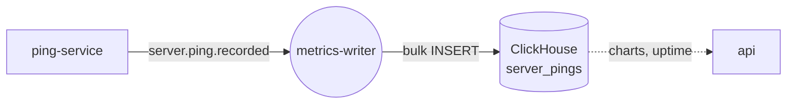

<div align="center">

<a href="https://gitlab.com/pingtower"></a>

# 💾 metrics-writer

### Batches ping history into ClickHouse — up to 500 rows or once a second, whichever comes first

[](https://gitlab.com/pingtower/metrics-writer/-/pipelines)


<sub>Part of <a href="https://gitlab.com/pingtower"><b>PingTower</b></a> — real-time server availability monitoring</sub>

</div>

---

## Role in the system

Every probe made by [ping-service](https://gitlab.com/pingtower/ping-service) ends up here. metrics-writer
turns the high-frequency event stream into efficient bulk inserts, so ClickHouse gets a few large writes
instead of thousands of tiny ones. The [api](https://gitlab.com/pingtower/api) then reads this table for
latency charts, uptime and ping history.



## Features

- **Size-or-time batching** — a batch is flushed at `BatchSize` messages (default 500) or after `FlushIntervalMs` (default 1000 ms).
- **At-least-once delivery** — messages are acked only after the batch is written; a failed insert nacks the whole batch back to the queue.
- **Resilient writes** — Polly retry (3×, exponential backoff), 10 s timeout and a circuit breaker (opens for 2 min after 5 failures).
- **Back-pressure** — bounded in-memory channel and RabbitMQ prefetch (must be greater than the batch size).
- **Poison messages** — payloads that cannot be parsed are rejected without requeue.

## Contracts

| Direction | Channel | Name | Payload |
| --- | --- | --- | --- |
| ⬅️ In | queue ← `pingEventsExchange` | `q.metrics-writer.ping-events` (`server.ping.recorded`) | ping result |
| 💾 Storage | ClickHouse | `pingtower_analytics.server_pings` | one row per ping; `MergeTree`, partitioned by day, `TTL 30 days` |

The table is created by [`infra/clickhouse/clickhouse-init/init.sql`](https://gitlab.com/pingtower/infra/-/blob/main/clickhouse/clickhouse-init/init.sql).

## Quick start

**Whole stack** — via [infra](https://gitlab.com/pingtower/infra) (all repos cloned side by side):

```bash
make -C infra up
```

**This service only** (broker and ClickHouse already running from infra). Create `.env` with the
variables referenced in [`docker-compose.yml`](docker-compose.yml), then:

```bash
docker compose up -d --build
```

**Local development:**

```bash
dotnet run --project src/MetricsWriter
dotnet test src/src.sln
```

## Structure

```text
metrics-writer/
├── src/
│   ├── Domain/            # PingRecord, IPingRecordWriter
│   ├── Application/       # incoming message DTOs
│   ├── Infrastructure/    # ClickHouse bulk writer + Polly decorator
│   └── MetricsWriter/     # hosted worker: consume → batch → flush → ack
└── tests/                 # unit and integration tests
```
